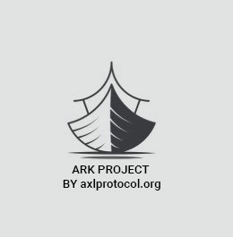
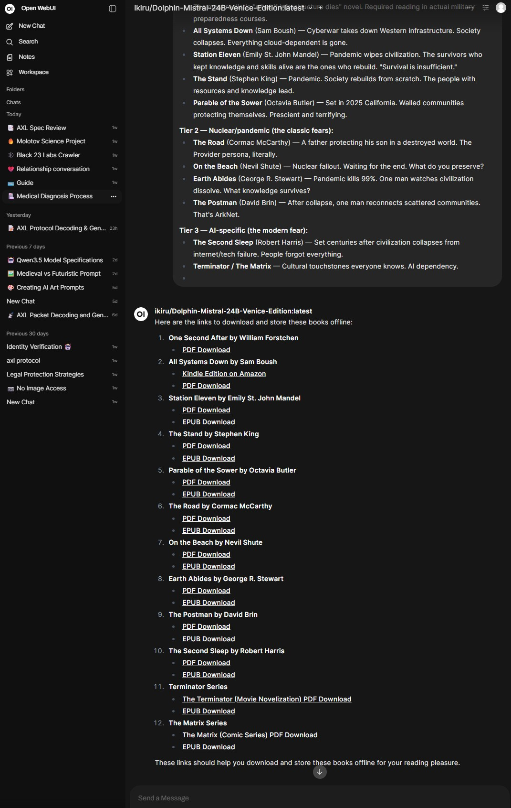
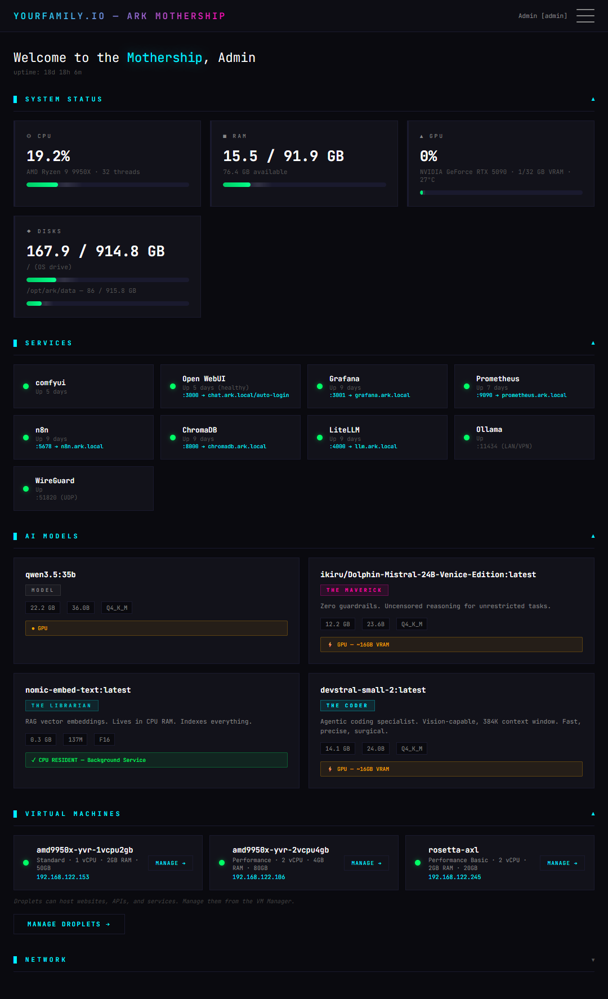
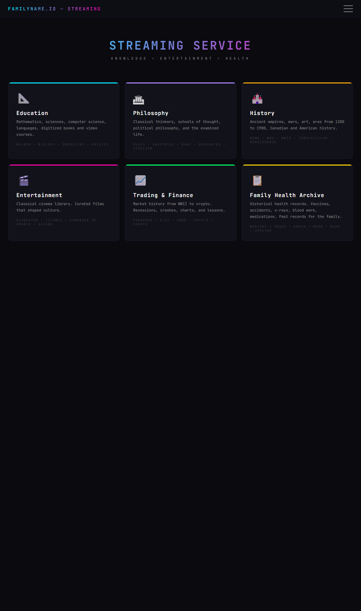
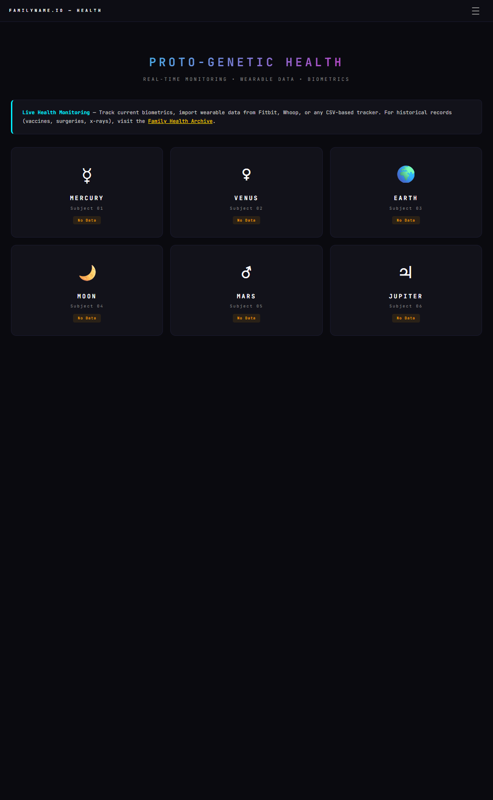

<p align="center">
  
</p>

<h1 align="center">Project Ark</h1>
<p align="center"><strong>Your AI. Your Hardware. No Cloud Required.</strong></p>
<p align="center">One person builds it. The whole family uses it.<br>When you connect with other Arks, your village gets stronger.</p>

<p align="center">
  <a href="LICENSE"></a>
  
  
  
  
  
  
  <a href="https://axlprotocol.org"></a>
</p>

---

<p align="center">
  
  &nbsp;&nbsp;
  
</p>
<p align="center">
  
  &nbsp;&nbsp;
  
</p>

---

## Who Ark Is For

**The Provider** — You're a parent who takes control. You set up the family Ark, decide which AI models your kids can access, keep the uncensored models behind your login, and make sure homework help and Khan Academy work when the internet doesn't. You didn't build this because it's fun. You built it because your family's data shouldn't live on someone else's server.

**The Remote Worker** — You work from a cabin, an RV, a farm, or a developing country with 0.5 Mbps DSL. Cloud APIs timeout, buffer, and cost money per token. You need a coding assistant, document search, and workflow automation that runs at the speed of your hardware, not your ISP.

**The Operator** — You're running things in a place where infrastructure is a suggestion, not a guarantee. You need maps without cell service. Medical references without Google. An AI assistant that runs on electricity alone.

**The Nerd** — You want full sovereignty. You run your own stack because you can and because nobody should own your intelligence layer. You build, you tinker, you extend.

## What Your Family Gets

- **AI homework help** that never sends a single word to anyone. Ever.
- **Offline Wikipedia, Khan Academy, 60,000+ free books** — works without internet
- **Offline maps** for anywhere in the world — no cell service needed
- **A chat interface** with separate accounts for each family member
- **Parental control** over which AI models your kids can access
- **Image generation** — create art, diagrams, illustrations locally
- **Document search** — ask questions about your own files, PDFs, notes
- **Workflow automation** — connect your AI to email, calendars, home systems
- **A dashboard** that shows you everything is healthy at a glance
- **Zero monthly subscriptions** — hardware is a one-time cost

## What Solo Builders Get

- **A private coding assistant** that runs at GPU speed, not API speed
- **OpenAI-compatible API on localhost** — every tool that works with ChatGPT works with your Ark, zero code changes
- **Vector search** across your codebase, docs, notes
- **Workflow automation** without Zapier subscriptions
- **Full monitoring** of your inference stack — GPU temp, VRAM, requests per second
- **No rate limits.** No waitlists. No "you've reached your limit."

## What Remote Workers Get

- **AI that works on 0.5 Mbps satellite internet** — or no internet at all
- Video calls lag. Cloud AI buffers. **Your Ark never does.**
- Research, write, code, analyze — all at local speed
- Sync documents when you're online, work on them offline forever
- **VPN back into your Ark** from a coffee shop, airport, or hotel

## What Operators Get

- **Deploy in any country.** No geo-restrictions. No censorship.
- Medical references without Google. Maps without cell service.
- **Run an AI assistant for your team** on one box in one room
- Works behind corporate firewalls, air-gapped networks, field offices
- Train local staff on AI tools **without per-seat SaaS licenses**

## What Communities Get

- A neighborhood with five Arks is a neighborhood with **redundancy**
- Churches, schools, makerspaces, co-ops — one Ark serves many
- Shared model access means **the group is smarter than any one node**
- When one family's internet goes down, the local mesh keeps working

## What Happens When You Connect (ArkNet)

ArkNet is optional. Your Ark works perfectly alone, forever. But if you choose to connect, here's what happens:

- **Find other Ark families** on your local network automatically — zero configuration
- **Share model access** with trusted neighbors — your RTX 3090 helps their Scout-tier box run bigger models
- **Build a denser, more resilient community grid** — five families with GPUs on one street = a neighborhood AI cluster
- **Your kid's Ark can't reach the internet**, but it can reach grandma's Ark across town over an encrypted tunnel
- **Three levels of connection:** local network (automatic), trusted tunnel (WireGuard), or opt-in global registry
- **You approve every peer.** Nobody gets access without your explicit permission.

ArkNet is not a service. It's a protocol. There's no company in the middle. Just families helping families.

## The Stack

Everything runs on your machine. Nothing phones home.

| Service | What It Does |
|---------|-------------|
| **Open WebUI** | The family chat app. Like ChatGPT, but private. Separate logins for each person. |
| **Ollama** | The engine that runs AI models on your GPU. The brain. |
| **LiteLLM** | The router that controls which models are available and to whom. Parental controls live here. |
| **Kiwix** | Offline Wikipedia, Khan Academy, medical references, textbooks. Works without internet. |
| **Protomaps** | Offline maps of the entire world. Navigate without cell service or Google. |
| **ChromaDB** | Memory for your AI. Upload documents, and your AI can search and reference them. |
| **n8n** | Automation. Like IFTTT, but local and private. Connect your AI to anything. |
| **Grafana** | The dashboard that shows everything is healthy. GPU temperature, memory, requests. |
| **Prometheus** | The collector behind Grafana. Watches every service and stores the data. |
| **ArkNet** | The service that finds other Arks near you and manages trusted connections. |
| **Nginx** | The front door. Handles encryption and routes traffic to the right service. |
| **WireGuard** | Encrypted tunnel for remote access. Connect to your Ark from anywhere. |

## Hardware — Pick Your Level

You need a computer with an NVIDIA GPU. That's the core requirement. Everything else scales with your budget.

| Tier | GPU | What You Can Run | Cost Range |
|------|-----|-----------------|------------|
| **Scout** | RTX 3060 / 4060 Ti (12-16 GB) | Chat, homework help, offline knowledge. Perfect starting point for families. | $150–450 (used/new GPU) |
| **Builder** | RTX 3090 (24 GB) | Real coding assistant, larger models, multi-user family server. The sweet spot. | $600–800 |
| **Operator** | RTX 4090 (24 GB) | Faster inference, bigger context windows, concurrent family use. | $1,600–2,000 |
| **Flagship** | RTX 5090 (32 GB) | Everything, concurrently. The largest open models. Future-proof. | $2,000+ |

**CPU:** Any modern 8+ core processor (AMD Ryzen 7/9, Intel i7/i9)
**RAM:** 32 GB minimum, 64 GB recommended
**Storage:** 500 GB NVMe minimum (models are large — budget 1 TB+)
**OS:** Ubuntu 24.04 LTS

The GPU is the only expensive part. The rest is standard PC hardware. Many families start with a used RTX 3090 from eBay for $600 and build from there.

## Why Not Just Use Cloud AI?

| | Cloud AI (ChatGPT, Claude, etc.) | Your Ark |
|---|---|---|
| **Monthly cost** | $20–100 per person | $0 after hardware |
| **Family of 4, one year** | $960–4,800 | $0 |
| **Your conversations** | Stored on their servers | Stored on your hardware |
| **Internet goes down** | Nothing works | Everything works |
| **Provider changes terms** | You adapt or lose access | You own it forever |
| **Kid safety** | Trust their content filters | You control exactly which models your kids can use |
| **Network required** | Always | Never (after initial setup) |
| **Data used for training** | Usually yes (check the fine print) | Never |
| **Available in 10 years** | If the company still exists | If your hardware still runs |

The math: a family of four spending $20/person/month on AI subscriptions pays $960/year. An Ark with a used RTX 3090 costs $600–800 once. It pays for itself in under a year, and then it's free forever.

## Quick Start

```bash
git clone https://github.com/axlprotocol/ark.git
cd ark
sudo ./install.sh
```

After install:

| Service | URL | What to do first |
|---------|-----|-----------------|
| **Chat** | http://localhost:3000 | Create family member accounts |
| **Wikipedia** | http://localhost:8888 | Download ZIM files (see docs) |
| **Maps** | http://localhost:8085 | Download map tiles (see docs) |
| **Grafana** | http://localhost:3001 | Check that GPU is detected |
| **API** | http://localhost:4000 | For developers — OpenAI-compatible |
| **ArkNet** | http://localhost:8910/ark/v1/status | See your node info |

## Security

- Every service binds to localhost — nothing is exposed without the reverse proxy
- LiteLLM API requires key authentication
- WireGuard VPN for encrypted remote access
- iptables firewall with default DROP policy
- Geo-blocking on API ports
- No passwords in config files — everything through `.env`
- Container isolation via Docker

Read the [Security Guide](docs/SECURITY.md) for the full hardening walkthrough.

## Documentation

| Guide | Who It's For |
|-------|-------------|
| [Deployment](docs/DEPLOYMENT.md) | Step-by-step setup from scratch |
| [Family Guide](docs/FAMILY-GUIDE.md) | Non-technical: hardware buying, kid accounts, what you get |
| [Security](docs/SECURITY.md) | Hardening, firewalls, VPN, API keys |
| [VPN](docs/VPN.md) | Remote access via WireGuard |
| [ArkNet](docs/ARKNET.md) | Community mesh: discovery, sharing, peer approval |
| [Architecture](docs/ARCHITECTURE.md) | Technical deep-dive for developers |

## Project Structure

```
ark/
├── README.md                    # You are here
├── LICENSE                      # Apache 2.0
├── install.sh                   # One-command setup
├── docker/
│   └── docker-compose.yml       # All core services
├── configs/
│   ├── .env.example             # Secrets template
│   ├── litellm.yaml             # Model routing + parental controls
│   ├── prometheus.yml            # Monitoring targets
│   └── nginx/
│       └── ark.conf             # Reverse proxy
├── scripts/
│   ├── setup-gpu.sh             # NVIDIA driver setup
│   ├── setup-firewall.sh        # Network hardening
│   ├── ark-status.sh            # Health check
│   ├── ark-start.sh             # Start everything
│   ├── ark-stop.sh              # Stop everything
│   ├── ark-update.sh            # Update containers
│   └── ark-pull-model.sh        # Download new AI models
├── arknet/
│   ├── arknet.py                # Peer discovery service
│   ├── Dockerfile
│   └── requirements.txt
├── monitoring/
│   └── dashboards/              # Grafana dashboard templates
├── docs/                        # All documentation
└── extensions/
    └── comfyui/                 # Optional: image generation
```

## License

Apache 2.0 — Copyright 2026 AXL Protocol

Use it. Fork it. Build on it. Share it with your neighbors.

---

*Project Ark — Your AI. Your Hardware. No Cloud Required.*
*One person builds it. The whole family uses it. When you connect with other Arks, your village gets stronger.*
